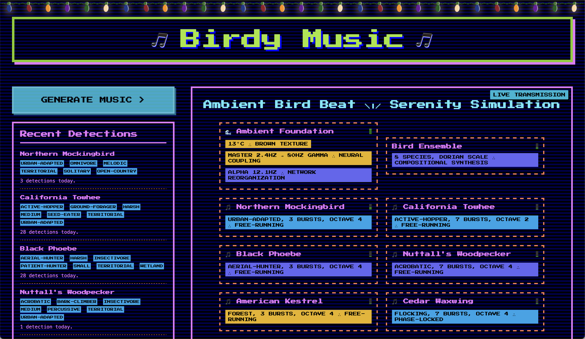

# christmas-lights.js

Add interactive Christmas lights to any web page



## Usage

```html
<script src="https://cdn.jsdelivr.net/npm/tone@15/build/Tone.js"></script>
<script type="module" src="https://unpkg.com/christmas-lights?module"></script>
<christmas-lights></christmas-lights>
```

## Development

Check out this repository, then run:

    cd christmas-lights
    npm install

Then to start a local development server (using Vite):

    npm run dev

Then visit `http://localhost:5173`

## In the Wild

- [BirdyMusic.com](https://birdymusic.com)
- [BradlyFeeley.com](https://bradlyfeeley.com)
- [ToDone List](https://strikings.com)

Would you like your site added? Request it [here](https://github.com/bradly/christmas-lights.js/issues/new).
